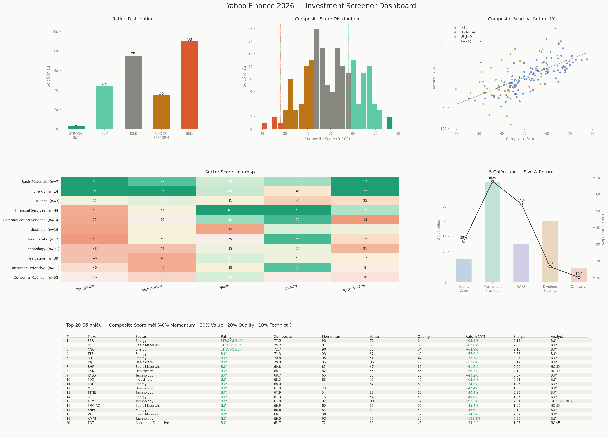

# Yahoo Finance Global Markets 2026


A multi-asset investment analysis pipeline covering **451 tickers across 8 asset classes** (April 2025 – April 2026). Builds a composite Alpha Scoring model from Value, Quality, Momentum, and Technical factors, then filters stocks into 5 actionable investment strategies

---

## 📊 Dashboard Preview



---

## 🛠 Project Structure

```
├── eda_yahoo_finance.py          # Phase 1 - Data cleaning & EDA (7 data issues)
├── technical_analysis.py         # Phase 2 - RSI, MACD, Bollinger Bands, Golden Cross
├── screener.py                   # Phase 3 - Composite scoring & 5 strategy screeners
├── yahoo_finance_global_markets_2026.csv  # Raw dataset (451 tickers, 131 columns)
├── EDA_report.md                 # EDA findings & data quality report
├── technical_analysis_report.md  # Technical analysis methodology & results
├── FINAL_report.md               # Composite scoring design & strategy results
├── images/                       # All chart outputs
└── requirements.txt
```

---

## 📊 Dataset

| Attribute | Value |
|-----------|-------|
| Tickers | 451 |
| Columns | 131 |
| Asset Classes | US_MEGA, US_MID, INTL, ETF, CRYPTO, FOREX, COMMODITIES, INDICES |
| Period | April 2025 – April 2026 |
| Currency | Normalized to USD |

---

## 🔥Pipeline

### Phase 1 - EDA & Data Engineering (`eda_yahoo_finance.py`)

Identifies and resolves 7 structural data issues:

1. **Structural NaN** - 45–68% null in fundamental columns for non-equity assets (by design, not error). Solution: split equity vs non-equity datasets
2. **Extreme outliers** - P/E = 3739 (bond ETF), P/B = -283 (negative equity). Solution: winsorization with economically justified bounds
3. **Wrong data types** - date columns stored as strings (`DD/MM/YYYY`). Solution: `pd.to_datetime()`
4. **Multi-currency** - KRW, AUD, GBP prices not comparable. Solution: use `market_cap_usd` for cross-country analysis
5. **Impossible returns** - `return_1y_pct < -100%` from leveraged ETFs (SOXS = -236%). Solution: flag, don't delete
6. **Missing sector** - 100% null for non-equity. Solution: fill from `asset_class`
7. **Extreme margins/ROE** - ABBV ROE = 6225% due to buyback-driven tiny equity. Solution: flag `flag_extreme_margins`

### Phase 2  Technical Analysis (`technical_analysis.py`)

Builds a composite technical score (0–100) from 5 signals:

| Signal | Weight |
|--------|--------|
| RSI (14) in [40, 65] | Bullish zone |
| MACD Crossover = BULLISH | Momentum confirmation |
| Golden Cross (SMA50 > SMA200) | Long-term trend |
| Bollinger %B in [0.3, 0.8] | Mid-band positioning |
| Price > SMA50 | Short-term trend |

### Phase 3 - Composite Scoring & Screener (`screener.py`)

All sub-scores are **percentile-ranked (0–100)** before weighting to eliminate scale bias:

| Factor | Weight | Components |
|--------|--------|------------|
| Momentum Index | 40% | 3M return, 1Y return, Sharpe, RSI |
| Value Index | 30% | P/E, Forward P/E, P/B, Analyst upside |
| Quality Index | 20% | ROE, Profit margin, ROA, Revenue growth, D/E |
| Technical Signal | 10% | Composite technical score |

---

## 🔥Key Results

| Metric | Value |
|--------|-------|
| Composite score correlation with 1Y return | Improved vs original score |
| STRONG BUY stocks (score ≥ 72) | ~15% of equity universe |
| Quality Value strategy | High-quality stocks at discount |
| Momentum Breakout strategy | Golden Cross + RSI + Analyst BUY |

### 5 Investment Strategies

| Strategy | Criteria | Focus |
|----------|----------|-------|
| **A - Quality Value** | Quality ≥ 65th pct + Value ≥ 55th pct | Buffett-style |
| **B - Momentum Breakout** | Momentum ≥ 70th pct + Tech score ≥ 3 + Golden Cross | Trend following |
| **C - GARP** | Revenue growth > 10% + P/E < 50 | Growth at reasonable price |
| **D - Dividend Stability** | Yield > 2% + Volatility < 30% + P/E < 30 | Income investing |
| **E - Contrarian Oversold** | RSI < 40 + Analyst upside > 30% | Mean reversion |

---

## 🖥 Installation

```bash
git clone https://github.com/DMO-droid/Yahoo-Finance-Global-Markets-2026.git
cd Yahoo-Finance-Global-Markets-2026
pip install -r requirements.txt
```

## Usage

Run each phase in order:

```bash
# Phase 1 — EDA & cleaning
python eda_yahoo_finance.py

# Phase 2 — Technical analysis
python technical_analysis.py

# Phase 3 — Screener & composite scoring
python screener.py
```

Outputs:
- `screener_dashboard.png` - 6-panel visual dashboard
- `screener_results.xlsx` - 6-sheet Excel report (one per strategy + master ranking)

---

## Charts

| Chart | Description |
|-------|-------------|
| `composite_distribution.png` | Score distribution across equity universe |
| `composite_vs_return.png` | Score vs 1Y return scatter (validation) |
| `sector_heatmap.png` | Sector-level composite, momentum, value, quality |
| `strategies_comparison.png` | 5 strategies - stock count & avg return |
| `top20_table.png` | Top 20 stocks by composite score |
| `rsi_distribution.png` | RSI distribution across asset classes |
| `volatility_sharpe.png` | Risk-return scatter |

---

## Tech Stack

- **Python 3.10+**
- **pandas** - data manipulation & cleaning
- **numpy** - numerical operations & percentile ranking
- **matplotlib** - all visualizations & dashboard
- **seaborn** - EDA charts
- **openpyxl** - Excel export
