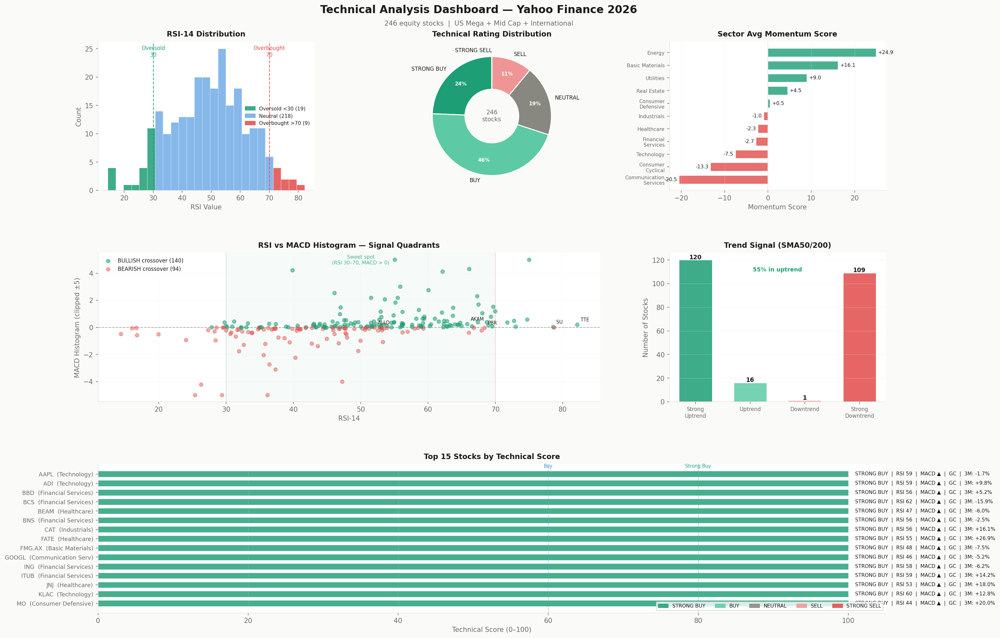

# Technical Analysis & Momentum Pipeline Report
> Following the initial data cleaning, this module automates the screening of global equity markets (US Mega, Mid-Cap, and International stocks) to identify high-probability trade setups based on price momentum
>  and trend strength

## Core Functions
**Automated Technical Signal Generation**
> The system evaluates four primary technical dimensions to determine asset health:
* **RSI-14 (Relative Strength Index):** Categorizes assets into Oversold ($<30$), Overbought ($>70$), or Neutral zones
* **Trend Dynamics:** Monitors the Golden Cross (SMA 50 crossing above SMA 200) and price position relative to long-term averages to identify "Strong Uptrends"
* **MACD Momentum:** Analyzes the MACD Histogram and crossovers to confirm if bullish or bearish momentum is accelerating
* **Bollinger Bands (BB %B):** Measures price location within volatility bands to detect potential trend exhaustion or breakouts

**Proprietary Scoring & Rating System**
> The script converts raw technical data into a standardized Composite Technical Score (0–100):
* **Scoring Logic:** Points are allocated across RSI (25 pts), MACD (25 pts), Trend/SMA (25 pts), and BB Position (25 pts)
* **Performance Ratings:** Assets are classified into five actionable tiers: Strong Buy ($\ge 80$), Buy, Neutral, Sell, and Strong Sell ($<20$)

**Sector Momentum Analysis**
> The engine aggregates individual ticker data to rank sectors based on:
* Average Momentum and Technical scores
* Percentage of tickers exhibiting a Golden Cross
* Average 3-month and 1-month returns to identify leading market segments

## 📊 Key Outputs & Deliverables
> The pipeline generates three high-value assets for decision-making:
1. technical_analysis_report.png: A 6-chart visual dashboard displaying RSI distributions, technical ratings, sector heatmaps, and signal quadrants (RSI vs. MACD)
2. tech_signals_summary.csv: A comprehensive master table containing every calculated signal for the entire equity universe
3. watchlist_strong_buy.csv: A curated shortlist of "Strong Buy" candidates that satisfy strict uptrend and healthy momentum criteria

